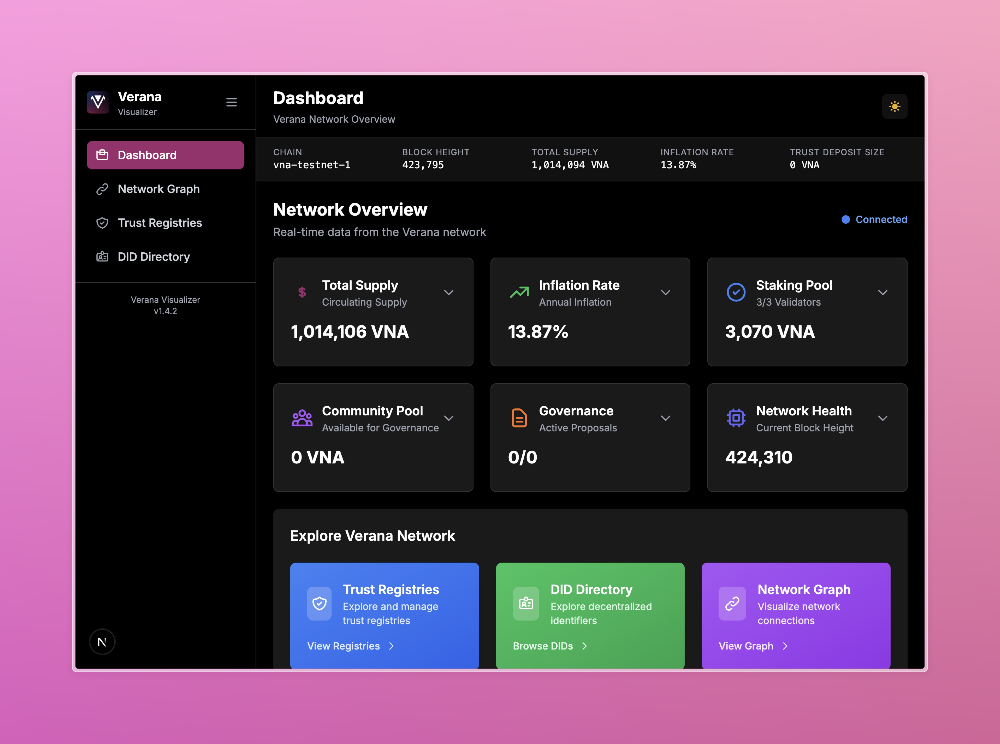

<div align="center">
  
  
  <h2>Verana Visualizer</h2>

  <p>A modern, interactive frontend for exploring the Verana decentralized trust layer.</p>

  <a href="https://nodejs.org/en"></a>
  <a href="https://nextjs.org/"></a>
  <a href="https://www.typescriptlang.org/"></a>
  <a href="https://tailwindcss.com/"></a>
  <a href="#docker"></a>
  <a href="#kubernetes"></a>
  <a href="#helm"></a>
  <a href="LICENSE"></a>
  <a href="https://discord.gg/edjaFn252q"></a>
</div>

<div align="center">
  
</div>

---

### What is this?

The Verana Visualizer is a containerized Next.js application that presents Verana network activity and entities through a delightful, responsive UI. It lets you search and explore Trust Registries, their versions and documents, Credential Schemas, and relationships across the network. The visualizer includes interactive analytics charts that display **real historical blockchain data** by querying network state at different block heights.

- Verana is an open initiative building a decentralized trust layer with DIDs, verifiable credentials, and public permissionless trust registries.
- This visualizer focuses on discovery and transparency: find a Trust Registry by ID, inspect its attributes and versions, view related Credential Schemas, see connections as a network graph, and analyze network trends through interactive charts powered by actual on-chain data.

**Note on Charts**: The analytics charts fetch historical data by querying the blockchain state at 30 different block heights over the past 30 days. Initial load takes 10-30 seconds as it retrieves real on-chain data. All displayed metrics represent actual network state—not simulated or estimated values.

---

### Table of contents

- [Overview](#overview)
- [Features](#features)
- [Tech stack](#tech-stack)
- [Quick start](#quick-start)
- [Configuration](#configuration)
- [Local development](#local-development)
- [Docker](#docker)
- [Kubernetes](#kubernetes)
- [Helm](#helm)
- [AWS Lambda (container image)](#aws-lambda-container-image)
- [Project structure](#project-structure)
- [Roadmap](#roadmap)
- [Contributing](#contributing)
- [License and community](#license-and-community)

---

### Overview

This app consumes Verana network endpoints to surface:

- Trust Registries (metadata, controller, versions, documents)
- Credential Schemas (JSON Schema, management modes, validity windows)
- Basic network stats and chain identity
- An interactive network graph for relationships and ecosystem mapping

The application is built for real-world operations: dark/light theme, responsive layout, accessible UI patterns, and first-class containerization for easy deployment.

### Features

- Header with Verana branding, chain info, and theme toggle
- Trust Registry search by ID, with rich details and formatted JSON Schema
- Clickable external links and safe formatting
- Automatic conversions (e.g., deposit in uvna to VNA)
- **Interactive Analytics Charts** with **real blockchain data**:
  - Token supply trends over 30 days (area chart)
  - Inflation rate history (line chart with dual Y-axis)
  - Top 10 validator distribution by voting power (bar chart)
  - Staking distribution: bonded vs unbonded (pie chart)
  - Network activity: transactions, gas, block time (composed chart)
  - Fetches historical state by querying different block heights
  - Loading progress indicators
  - Dark mode support and fully responsive
  - Interactive tooltips and legends
- Network Graph view for relationships
- Dashboard with at-a-glance metrics
- Responsive and mobile-friendly
- 3D network graph with:
  - Smooth zoom-to-focus on node click
  - Link particle effects with subtle periodic pulses
  - Adjustable forces and curved links for readability
  - Context panel with rich details for TRs and DIDs
  - Fit-to-view (Center) control and fullscreen toggle
  - Help overlay with controls and color legend

### Tech stack

- Next.js 15 (App Router, standalone output)
- React 18 + TypeScript 5
- Tailwind CSS 3
- Recharts 2.15 for interactive charts
- 3d-force-graph / three for 3D visualization

---

### Quick start

Prerequisites:

- Node.js 18+
- npm

Clone and run:

```bash
git clone https://github.com/verana-labs/verana-visualizer.git
cd verana-visualizer
npm install
cp .env.example .env.local
npm run dev
```

Then open http://localhost:3000

---

### Configuration

You can configure the visualizer via environment variables. For local development, use `.env.local`. For containers and clusters, use environment variables directly.

Environment variables (public runtime):

```env
NEXT_PUBLIC_BASE_URL=https://vis.testnet.verana.network
NEXT_PUBLIC_API_ENDPOINT=https://api.testnet.verana.network
NEXT_PUBLIC_RPC_ENDPOINT=https://rpc.testnet.verana.network
NEXT_PUBLIC_IDX_ENDPOINT=https://idx.testnet.verana.network
NEXT_PUBLIC_RESOLVER_ENDPOINT=https://resolver.testnet.verana.network
NEXT_PUBLIC_CHAIN_ID=vna-testnet-1
NEXT_PUBLIC_CHAIN_NAME=Testnet
NEXT_PUBLIC_APP_NAME=Verana Visualizer
NEXT_PUBLIC_APP_LOGO=logo.svg
```

Kubernetes/CD also supports the following Verana-specific envs (mapped in `kubernetes/verana-visualizer-deployment.yaml`):

```env
NEXT_PUBLIC_VERANA_CHAIN_ID=vna-testnet-1
NEXT_PUBLIC_VERANA_CHAIN_NAME=VeranaTestnet1
NEXT_PUBLIC_VERANA_RPC_ENDPOINT=https://rpc.testnet.verana.network
NEXT_PUBLIC_VERANA_REST_ENDPOINT=https://api.testnet.verana.network
NEXT_PUBLIC_VERANA_REST_ENDPOINT_TRUST_DEPOSIT=https://api.testnet.verana.network/verana/td/v1
NEXT_PUBLIC_VERANA_REST_ENDPOINT_DID=https://api.testnet.verana.network/verana/dd/v1
NEXT_PUBLIC_VERANA_REST_ENDPOINT_TRUST_REGISTRY=https://api.testnet.verana.network/verana/tr/v1
NEXT_PUBLIC_VERANA_REST_ENDPOINT_CREDENTIAL_SCHEMA=https://api.testnet.verana.network/verana/cs/v1
NEXT_PUBLIC_VERANA_SIGN_DIRECT_MODE=false
NEXT_PUBLIC_SESSION_LIFETIME_SECONDS=86400
```

- `NEXT_PUBLIC_BASE_URL` is the full URL where the application will be hosted (used for asset prefixing and base paths)
- Logo file is expected at `public/logo.svg`
- These defaults are set in `Dockerfile` and Helm `values.yaml` for convenience

---

### Local development

Common scripts:

- `npm run dev` – start dev server with HMR
- `npm run build` – production build
- `npm run start` – start the production server locally
- `npm run lint` – run ESLint
- `npm test` – run unit tests with coverage (Vitest)

When developing UI or data formats:

- JSON Schemas are rendered formatted for readability
- `snake_case` attribute names are shown in Title Case
- Null/empty values are hidden where appropriate
- External URLs are clickable and open in a new tab

---

### Docker

The application ships as a single container (multi-stage build).

Build locally:

```bash
docker build -t verana/verana-visualizer:local .
```

Run locally (override any env vars as needed):

```bash
docker run --rm -p 3000:3000 \
  -e NEXT_PUBLIC_API_ENDPOINT=https://api.testnet.verana.network \
  -e NEXT_PUBLIC_RPC_ENDPOINT=https://rpc.testnet.verana.network \
  -e NEXT_PUBLIC_IDX_ENDPOINT=https://idx.testnet.verana.network \
  -e NEXT_PUBLIC_RESOLVER_ENDPOINT=https://resolver.testnet.verana.network \
  -e NEXT_PUBLIC_CHAIN_ID=vna-testnet-1 \
  -e NEXT_PUBLIC_CHAIN_NAME=Testnet \
  -e NEXT_PUBLIC_APP_NAME="Verana Visualizer" \
  -e NEXT_PUBLIC_APP_LOGO=logo.svg \
  verana/verana-visualizer:local
```

---

### Kubernetes

You can deploy directly with the provided manifest.

```bash
kubectl apply -f k8s/deployment.yaml
```

This creates a `Deployment` and a `Service` of type `LoadBalancer`.

For production deployments to https://vis.testnet.verana.network/, we use GitHub Actions for continuous deployment:

1. Every push to `main` branch triggers the workflow
2. The Docker image is built and pushed to Docker Hub
3. The Kubernetes deployment is updated with the new image
4. An Ingress resource is created to expose the application at https://vis.testnet.verana.network/

The workflow file is at `.github/workflows/cd.yml`.

- To customize environment variables, edit `kubernetes/verana-visualizer-deployment.yaml` under the `env:` section
- Health probes and resource requests/limits are preconfigured
- The `NEXT_PUBLIC_BASE_URL` environment variable is set to ensure assets load correctly

Also see `.github/workflows/ci.yml` which runs tests on pushes and PRs using Node 20.

---

### Helm

There is a Helm chart at `helm/verana-visualizer/` with production-ready defaults.

Install (from repository root):

```bash
helm install verana-visualizer ./helm/verana-visualizer \
  --set image.repository=verana/verana-visualizer \
  --set image.tag=latest
```

Common overrides via `values.yaml` or `--set`:

- `replicaCount`
- `service.type` (default `LoadBalancer`)
- `resources.requests` / `resources.limits`
- `env.NEXT_PUBLIC_*` variables

Example env overrides:

```bash
helm upgrade --install verana-visualizer ./helm/verana-visualizer \
  --set env.NEXT_PUBLIC_CHAIN_NAME=Mainnet \
  --set env.NEXT_PUBLIC_CHAIN_ID=vna-mainnet-1
```

---

### AWS Lambda (container image)

You can run the visualizer on AWS Lambda by packaging it as a container image and using Lambda's container runtime. This approach preserves SSR while offering on-demand scaling.

High-level steps:

1) Build and tag the image for ECR

```bash
docker build -t <account-id>.dkr.ecr.<region>.amazonaws.com/verana-visualizer:lambda .
```

2) Push to ECR

```bash
aws ecr get-login-password --region <region> | docker login --username AWS --password-stdin <account-id>.dkr.ecr.<region>.amazonaws.com
docker push <account-id>.dkr.ecr.<region>.amazonaws.com/verana-visualizer:lambda
```

3) Create a Lambda function from the image

- Runtime: Provide your image URI
- Memory: 1024–2048 MB recommended
- Timeout: 10–30s recommended
- Handler/CMD: the container's default `CMD` is `node server.js`

4) Configure environment variables (the `NEXT_PUBLIC_*` set above)

5) Expose via API Gateway HTTP API

- Map the root path `/` to the Lambda function
- Enable binary/streaming if required by your setup

Note: For very low-latency web serving, a container orchestrator (Kubernetes) is typically preferred. Lambda is great for cost-efficient bursty traffic.

---

### Project structure

```
src/
├─ app/
│  ├─ dashboard/              # Main dashboard route
│  ├─ charts/                 # Interactive analytics charts (real blockchain data)
│  ├─ network-graph/          # Interactive 3D graph view
│  ├─ trust-registries/       # Trust registries explorer
│  ├─ did-directory/          # DID directory view
│  ├─ layout.tsx              # Root layout
│  ├─ page.tsx                # Home page
│  └─ globals.css             # Global styles
├─ components/
│  ├─ charts/                 # Recharts chart components
│  │  ├─ TokenSupplyChart.tsx
│  │  ├─ InflationChart.tsx
│  │  ├─ ValidatorDistributionChart.tsx
│  │  ├─ StakingDistributionChart.tsx
│  │  └─ NetworkActivityChart.tsx
│  ├─ Header.tsx, Sidebar.tsx, ThemeToggle.tsx
│  ├─ EnhancedDashboardCards.tsx
│  ├─ NetworkGraph3D.tsx, ForceGraph3DWrapper.tsx
│  ├─ DIDTable.tsx, TrustRegistryTable.tsx
│  └─ RefreshButton.tsx, ResultsSection.tsx, SearchForm.tsx
├─ lib/
│  ├─ api.ts                  # API client functions
│  └─ historicalDataFetcher.ts # Historical blockchain data fetcher
└─ types/
   └─ index.ts                # TypeScript type definitions
```

Routing:

- The root route redirects to `/dashboard`
- `/charts` - Interactive analytics with real historical blockchain data (30-day trends)
- `/network-graph` - 3D visualization of network relationships
- `/trust-registries` - Search and explore trust registries
- `/did-directory` - Browse decentralized identifiers

**Charts Feature**: The analytics page fetches historical data by querying blockchain state at different block heights using the Cosmos SDK `?height=X` parameter. This provides actual on-chain trends rather than simulated data. See [docs/architecture.md](docs/architecture.md) for complete implementation details.

---

### Roadmap

#### Phase 2 - Performance
- Client-side caching for faster chart loads
- Incremental data updates
- Service worker for offline support

#### Phase 3 - Features
- Custom time ranges for charts (7d, 90d, 1y)
- Data export (CSV, JSON, PNG)
- Chart customization options

#### Phase 4 - Advanced
- Indexer integration for sub-second data loading
- Custom dashboards and alerts
- Advanced analytics and predictions
- Multi-chain support

Have ideas? Open an [issue](https://github.com/verana-labs/verana-visualizer/issues) or [discussion](https://github.com/verana-labs/verana-visualizer/discussions)!

---

### Contributing

We welcome issues and pull requests.

1) Fork the repo
2) Create a feature branch
3) Commit with clear messages
4) Open a PR with context and screenshots if UI changes

---

### License and community

This project is licensed under MIT – see `LICENSE`.

- Docs: https://docs.verana.io/
- GitHub: https://github.com/verana-labs
- Repo: https://github.com/verana-labs/verana-visualizer/
- Discord: https://discord.gg/edjaFn252q

Don’t trust. Verify.