# Verana Visualizer - System Architecture

## Overview

The Verana Visualizer is a Next.js application that provides an interactive interface for exploring the Verana blockchain network. It fetches real-time and historical data from the Verana REST API and RPC endpoints to visualize network statistics, trust registries, DIDs, and relationships through interactive charts and 3D graphs.

---

## High-Level Architecture

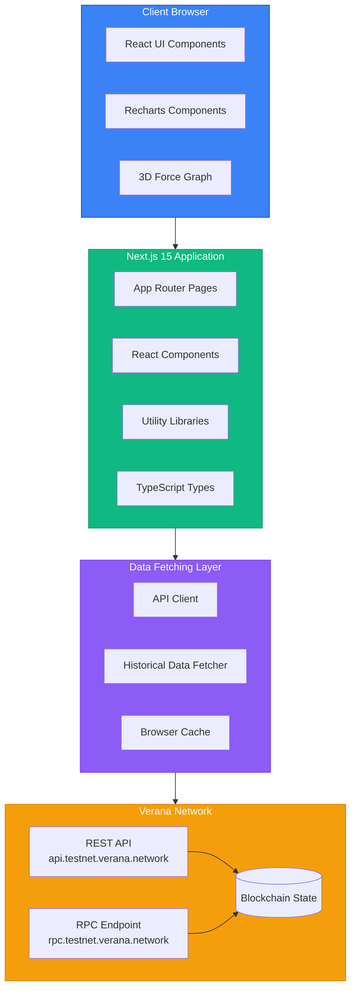

---

## Application Structure

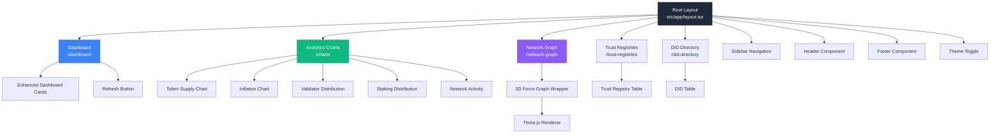

---

## Charts Data Flow - Historical Data Fetching

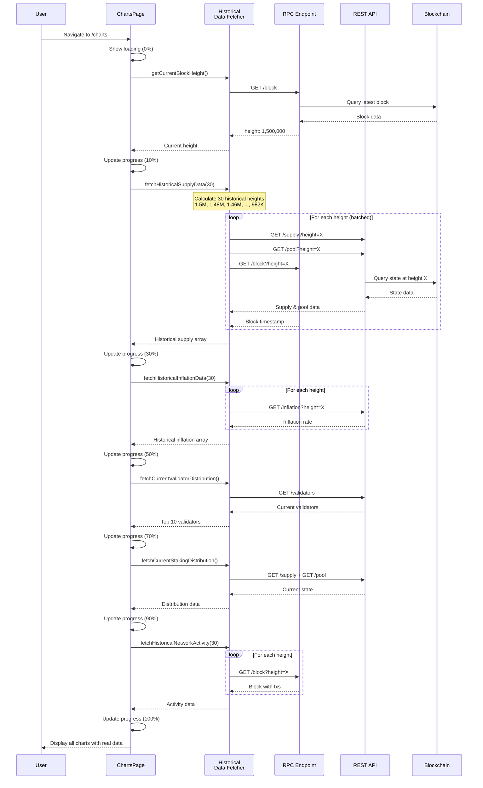

---

## Historical Data Algorithm

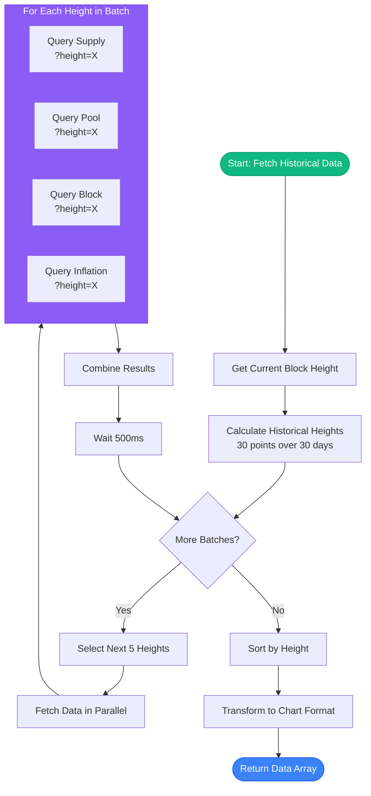

### Height Calculation Example

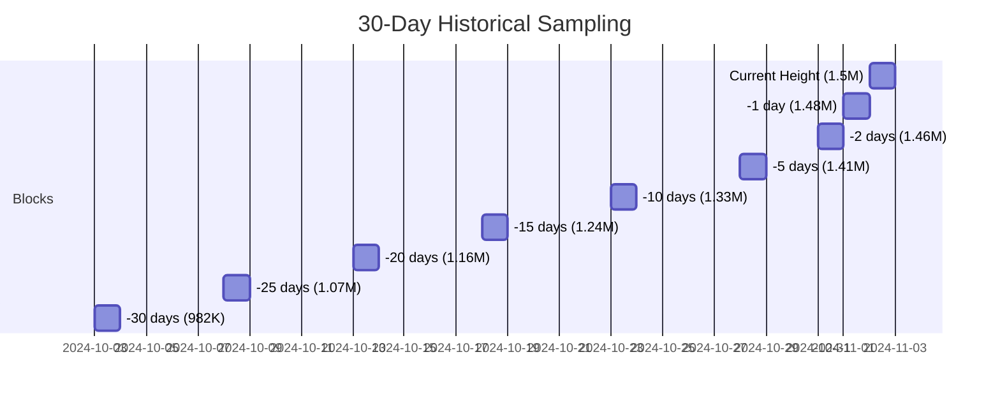

**Formula:**
```
blocks_per_day = 86400 / avg_block_time
blocks_per_day ≈ 17,280 (for 5s blocks)

height_at_day_N = current_height - (N × blocks_per_day)
```

---

## Component Architecture

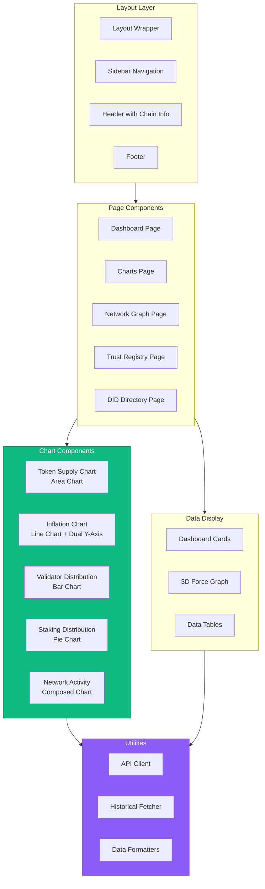

---

## Data Fetching Strategy

### Current State Data

```mermaid
flowchart LR
    subgraph Components
        A[Dashboard Cards]
        B[Charts Current Data]
    end
    
    subgraph API["API Client"]
        F1[fetchSupply]
        F2[fetchInflation]
        F3[fetchStakingPool]
        F4[fetchValidators]
        F5[fetchProposals]
    end
    
    subgraph Endpoints
        E1[/cosmos/bank/v1beta1/supply]
        E2[/cosmos/mint/v1beta1/inflation]
        E3[/cosmos/staking/v1beta1/pool]
        E4[/cosmos/staking/v1beta1/validators]
        E5[/cosmos/gov/v1/proposals]
    end
    
    A --> F1 & F2 & F3 & F4 & F5
    B --> F1 & F2 & F3 & F4
    
    F1 --> E1
    F2 --> E2
    F3 --> E3
    F4 --> E4
    F5 --> E5
    
    E1 & E2 & E3 & E4 & E5 --> Network[(Verana Network)]
```

### Historical State Data

```mermaid
flowchart TD
    Charts[Charts Page] --> HistFetcher[Historical Data Fetcher]
    
    HistFetcher --> GetHeight{Get Current<br/>Block Height}
    GetHeight --> CalcHeights[Calculate<br/>30 Heights]
    
    CalcHeights --> Loop{For Each<br/>Height}
    
    Loop -->|Batch 1| H1[Heights: 1.5M to 1.41M]
    Loop -->|Batch 2| H2[Heights: 1.41M to 1.33M]
    Loop -->|Batch 3| H3[Heights: 1.33M to 1.24M]
    Loop -->|...| H4[...]
    Loop -->|Batch 6| H6[Heights: 1.07M to 982K]
    
    H1 & H2 & H3 & H4 & H6 --> Fetch[Query Endpoints<br/>with ?height=X]
    
    Fetch --> E1[/supply?height=X]
    Fetch --> E2[/pool?height=X]
    Fetch --> E3[/inflation?height=X]
    Fetch --> E4[/block?height=X]
    
    E1 & E2 & E3 & E4 --> Build[Build Time Series]
    Build --> Sort[Sort by Height]
    Sort --> Display[Display in Charts]
    
    style Charts fill:#3b82f6,stroke:#2563eb,color:#fff
    style HistFetcher fill:#10b981,stroke:#059669,color:#fff
    style Display fill:#8b5cf6,stroke:#7c3aed,color:#fff
```

---

## Chart Component Composition

### Token Supply Chart (Area Chart)

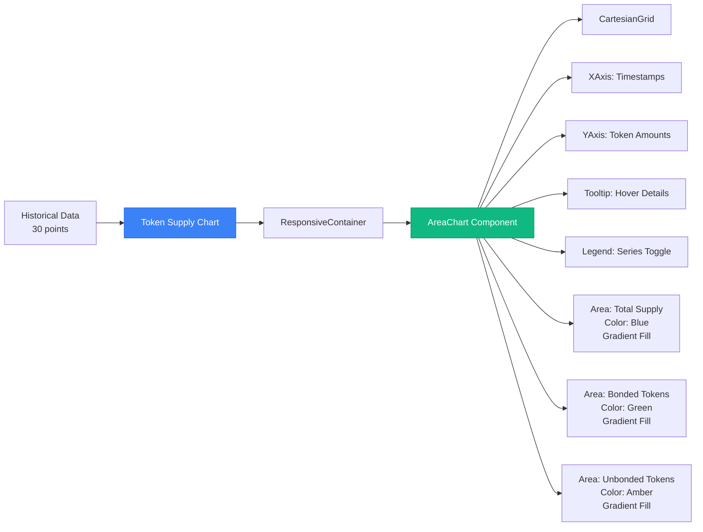

### Inflation Chart (Line Chart with Dual Y-Axis)

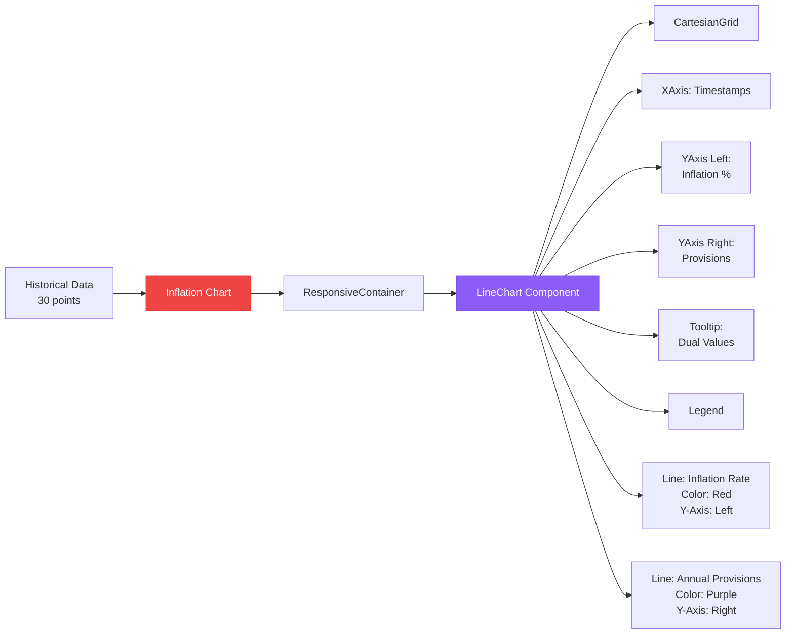

---

## Page Routing & Navigation

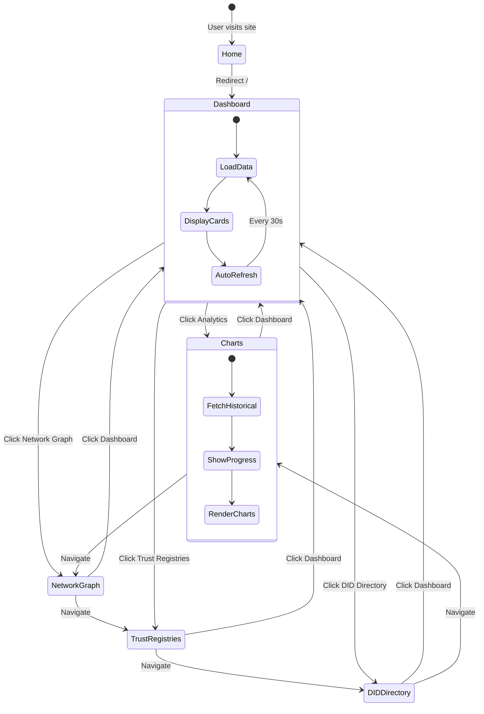

---

## Data Transformation Pipeline

### Token Supply Chart Data Pipeline

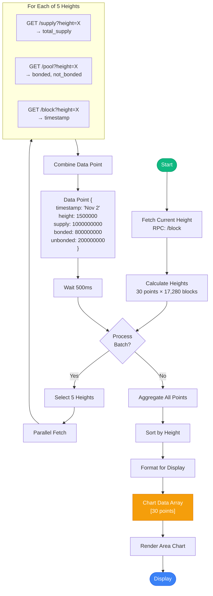

---

## API Integration Architecture

```mermaid
flowchart TB
    subgraph Frontend["Frontend Application"]
        Pages[Pages]
        Components[Components]
    end
    
    subgraph DataLayer["Data Fetching Layer"]
        APIClient[API Client<br/>src/lib/api.ts]
        HistFetcher[Historical Fetcher<br/>src/lib/historicalDataFetcher.ts]
    end
    
    subgraph Endpoints["Verana Network Endpoints"]
        direction TB
        
        subgraph REST["REST API (api.testnet.verana.network)"]
            R1[/cosmos/bank/v1beta1/*]
            R2[/cosmos/staking/v1beta1/*]
            R3[/cosmos/mint/v1beta1/*]
            R4[/cosmos/gov/v1/*]
            R5[/verana/tr/v1/*]
            R6[/verana/dd/v1/*]
        end
        
        subgraph RPC["RPC (rpc.testnet.verana.network)"]
            P1[/block]
            P2[/block?height=X]
            P3[/abci_info]
            P4[/genesis]
        end
    end
    
    Frontend --> DataLayer
    
    APIClient --> REST
    HistFetcher --> REST
    HistFetcher --> RPC
    
    REST --> Chain[(Blockchain<br/>State)]
    RPC --> Chain
    
    style Frontend fill:#3b82f6,stroke:#2563eb,color:#fff
    style DataLayer fill:#10b981,stroke:#059669,color:#fff
    style Endpoints fill:#f59e0b,stroke:#d97706,color:#fff
    style Chain fill:#8b5cf6,stroke:#7c3aed,color:#fff
```

---

## Network Graph 3D Visualization

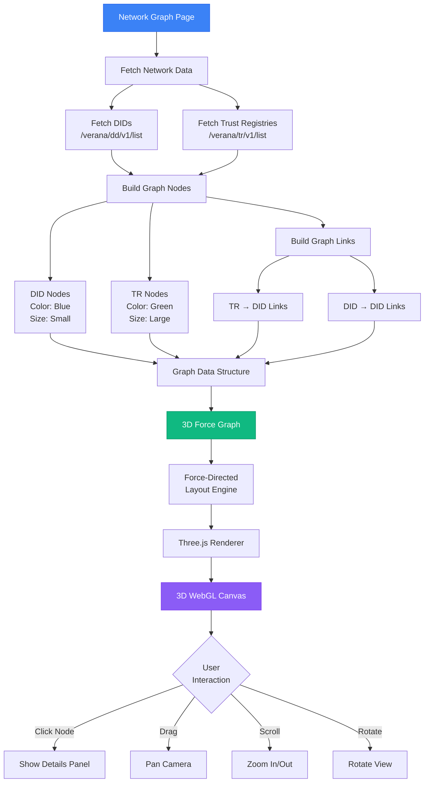

---

## State Management

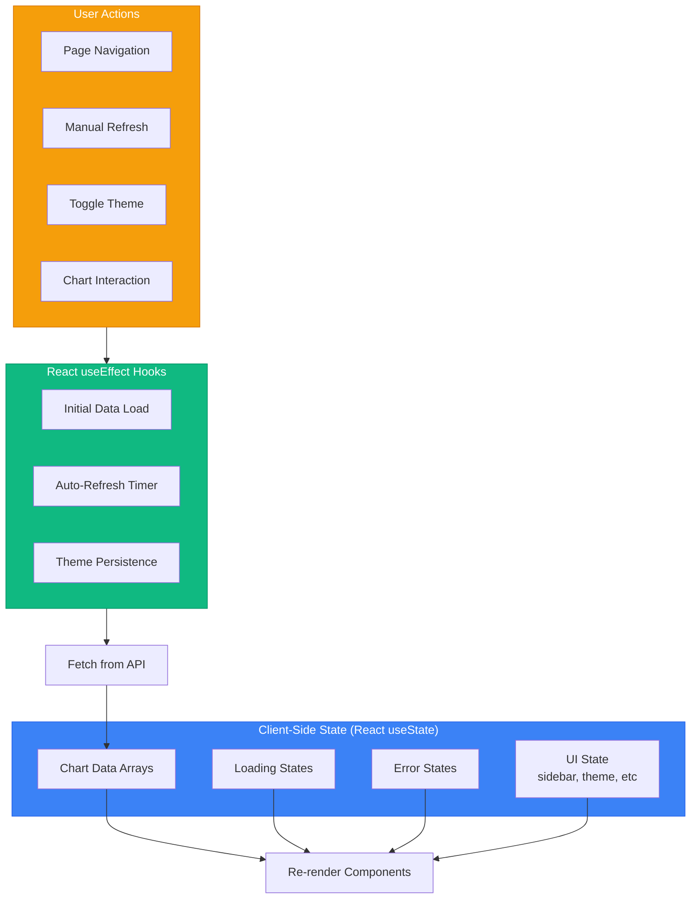

---

## Error Handling & Recovery

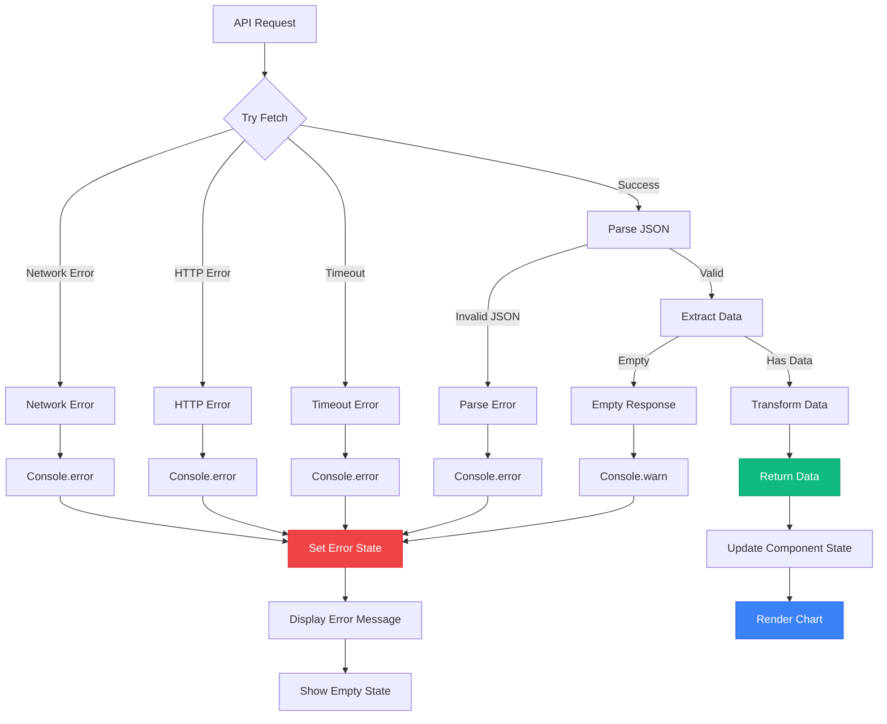

---

## Performance Optimization Strategy

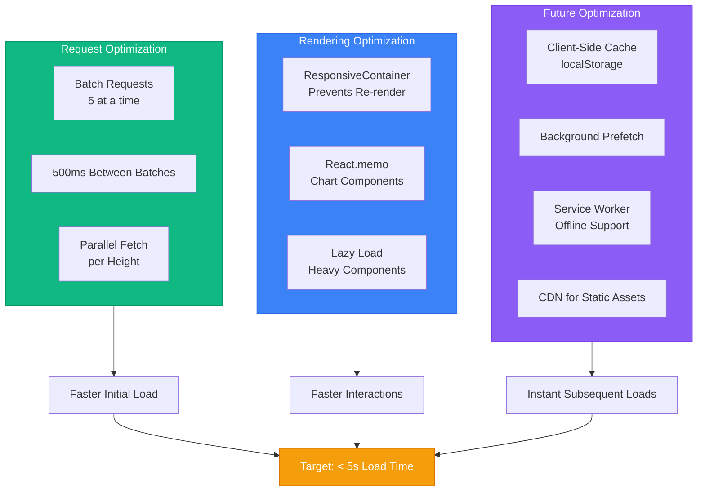

---

## Deployment Architecture

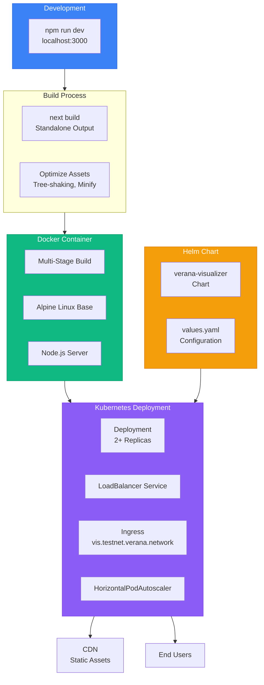

---

## Technology Stack

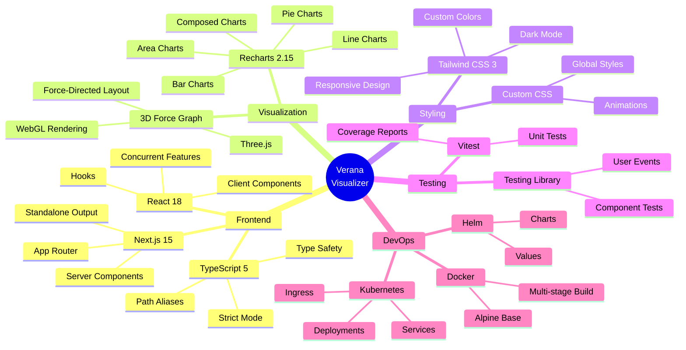

---

## Data Types & Interfaces

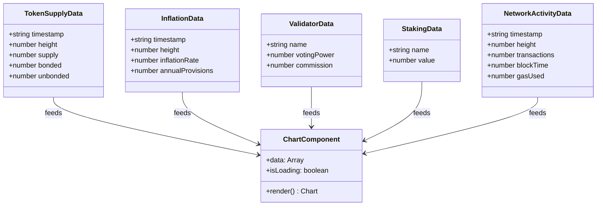

---

## API Response Flow

```mermaid
sequenceDiagram
    autonumber
    participant App as Application
    participant Fetcher as Data Fetcher
    participant API as REST API
    participant RPC as RPC Endpoint
    participant Chain as Blockchain
    
    App->>Fetcher: Request historical data
    Fetcher->>RPC: GET /block
    RPC->>Chain: Query latest block
    Chain-->>RPC: Latest block data
    RPC-->>Fetcher: height: 1,500,000
    
    Note over Fetcher: Calculate 30 heights:<br/>1.5M, 1.48M, 1.46M, ..., 982K
    
    loop For each batch of 5 heights
        Fetcher->>API: GET /supply?height=H1
        Fetcher->>API: GET /supply?height=H2
        Fetcher->>API: GET /supply?height=H3
        Fetcher->>API: GET /supply?height=H4
        Fetcher->>API: GET /supply?height=H5
        
        API->>Chain: Query state at H1
        API->>Chain: Query state at H2
        API->>Chain: Query state at H3
        API->>Chain: Query state at H4
        API->>Chain: Query state at H5
        
        Chain-->>API: Historical states
        API-->>Fetcher: Supply data points
        
        Note over Fetcher: Wait 500ms before next batch
    end
    
    Fetcher-->>App: Complete historical array
    App->>App: Render charts
```

---

## User Interaction Flow

```mermaid
flowchart TD
    Start([User Opens App]) --> Load[Load Dashboard]
    
    Load --> SeeCards[View Network Cards]
    
    SeeCards --> Decision1{What Next?}
    
    Decision1 -->|View Trends| ClickCharts[Click Analytics]
    Decision1 -->|Explore Network| ClickGraph[Click Network Graph]
    Decision1 -->|Find TR| ClickTR[Click Trust Registries]
    Decision1 -->|Browse DIDs| ClickDID[Click DID Directory]
    
    ClickCharts --> LoadCharts[Load Charts Page]
    LoadCharts --> ShowProgress[Show Loading Progress]
    ShowProgress --> Wait[Wait 10-30s]
    Wait --> DisplayCharts[Display 5 Charts]
    
    DisplayCharts --> Interact{Interact}
    
    Interact -->|Hover| ShowTooltip[Show Detailed Tooltip]
    Interact -->|Click Legend| ToggleSeries[Toggle Data Series]
    Interact -->|Scroll| ExploreData[Explore Different Charts]
    
    ShowTooltip --> Insights[Gain Insights]
    ToggleSeries --> Compare[Compare Metrics]
    ExploreData --> Analyze[Analyze Trends]
    
    Insights & Compare & Analyze --> Decision2{Next Action?}
    
    Decision2 -->|Check Network| ClickGraph
    Decision2 -->|More Analysis| ExploreData
    Decision2 -->|Done| Leave[Leave App]
    
    style Start fill:#10b981,stroke:#059669,color:#fff
    style DisplayCharts fill:#3b82f6,stroke:#2563eb,color:#fff
    style Insights fill:#f59e0b,stroke:#d97706,color:#fff
```

---

## Responsive Design Strategy

```mermaid
flowchart LR
    subgraph Mobile["Mobile (< 768px)"]
        M1[Collapsible Sidebar]
        M2[Stacked Charts]
        M3[Touch-Optimized]
        M4[Single Column]
    end
    
    subgraph Tablet["Tablet (768-1024px)"]
        T1[Partial Sidebar]
        T2[2-Column Grid]
        T3[Medium Charts]
        T4[Adaptive Layout]
    end
    
    subgraph Desktop["Desktop (> 1024px)"]
        D1[Full Sidebar]
        D2[Multi-Column Grid]
        D3[Large Charts]
        D4[Side-by-Side]
    end
    
    Mobile --> Breakpoints[Tailwind Breakpoints]
    Tablet --> Breakpoints
    Desktop --> Breakpoints
    
    Breakpoints --> CSS[Responsive CSS Classes]
    CSS --> Render[Optimal Rendering]
    
    style Mobile fill:#3b82f6,stroke:#2563eb,color:#fff
    style Tablet fill:#10b981,stroke:#059669,color:#fff
    style Desktop fill:#8b5cf6,stroke:#7c3aed,color:#fff
```

---

## Dark Mode Implementation

```mermaid
flowchart TD
    User[User Toggles Theme] --> Toggle[Theme Toggle Component]
    
    Toggle --> Check{Current<br/>Theme?}
    
    Check -->|Light| SetDark[Set to Dark]
    Check -->|Dark| SetLight[Set to Light]
    
    SetDark --> AddClass[Add 'dark' class to HTML]
    SetLight --> RemoveClass[Remove 'dark' class]
    
    AddClass --> SavePref[Save to localStorage]
    RemoveClass --> SavePref
    
    SavePref --> TriggerRerender[Trigger Re-render]
    
    TriggerRerender --> ApplyDark[Apply Dark Variants]
    
    subgraph DarkVariants["Dark Mode Variants"]
        BG[dark:bg-gray-900]
        Text[dark:text-white]
        Border[dark:border-gray-700]
        Charts[Custom Chart Colors]
    end
    
    ApplyDark --> DarkVariants
    DarkVariants --> Display[Display with Theme]
    
    style Toggle fill:#3b82f6,stroke:#2563eb,color:#fff
    style DarkVariants fill:#1f2937,stroke:#111827,color:#fff
```

---

## Build & Deployment Pipeline

```mermaid
flowchart LR
    subgraph Source["Source Code"]
        Code[TypeScript/React Code]
        Styles[Tailwind CSS]
        Assets[Static Assets]
    end
    
    subgraph Build["Next.js Build"]
        Compile[TypeScript Compilation]
        Bundle[Webpack Bundling]
        Optimize[Tree-shaking & Minify]
        Generate[Generate Static Files]
    end
    
    subgraph Output["Build Output"]
        Standalone[Standalone Server]
        Static[Static Assets]
        Server[Server Files]
    end
    
    subgraph Docker["Docker Image"]
        BaseImage[Node Alpine]
        CopyFiles[Copy Build Output]
        SetEnv[Set Environment]
        Expose[Expose Port 3000]
    end
    
    subgraph Deploy["Deployment"]
        Push[Push to Registry]
        K8s[Kubernetes Apply]
        Rollout[Rolling Update]
        Health[Health Checks]
    end
    
    Source --> Build
    Build --> Output
    Output --> Docker
    Docker --> Deploy
    
    Deploy --> Live[Live Application]
    
    style Build fill:#3b82f6,stroke:#2563eb,color:#fff
    style Docker fill:#10b981,stroke:#059669,color:#fff
    style Deploy fill:#8b5cf6,stroke:#7c3aed,color:#fff
    style Live fill:#f59e0b,stroke:#d97706,color:#fff
```

---

## Security Architecture

```mermaid
flowchart TD
    subgraph Public["Public Data Only"]
        NoAuth[No Authentication Required]
        NoSecrets[No API Keys Needed]
        ReadOnly[Read-Only Operations]
    end
    
    subgraph Network["Network Security"]
        HTTPS[HTTPS Only]
        CORS[CORS Configured]
        CSP[Content Security Policy]
    end
    
    subgraph Input["Input Validation"]
        TypeCheck[TypeScript Validation]
        Sanitize[URL Sanitization]
        SafeJSON[Safe JSON Parsing]
    end
    
    subgraph Container["Container Security"]
        NonRoot[Non-Root User]
        Minimal[Minimal Base Image]
        NoSecrets2[No Secrets in Image]
    end
    
    Public --> Safe[Inherently Safe]
    Network --> Protected[Network Protected]
    Input --> Validated[Input Validated]
    Container --> Secure[Container Secured]
    
    Safe & Protected & Validated & Secure --> SecureApp[Secure Application]
    
    style Public fill:#10b981,stroke:#059669,color:#fff
    style Network fill:#3b82f6,stroke:#2563eb,color:#fff
    style SecureApp fill:#8b5cf6,stroke:#7c3aed,color:#fff
```

---

## Future Enhancements

```mermaid
timeline
    title Verana Visualizer Roadmap
    
    section Phase 1 - Complete ✅
        Current Features : Dashboard
                        : Trust Registries
                        : DID Directory
                        : Network Graph
                        : Real-Time Charts
    
    section Phase 2 - Planned
        Performance : Client-Side Caching
                   : Incremental Data Loading
                   : Service Worker
                   : CDN Integration
    
    section Phase 3 - Future
        Advanced Features : WebSocket Real-Time
                         : Custom Dashboards
                         : Data Export (CSV/PNG)
                         : Alerts & Notifications
    
    section Phase 4 - Vision
        Enterprise : Multi-Chain Support
                  : Advanced Analytics
                  : Predictive Models
                  : API for Integration
```

---

## Key Design Decisions

### 1. Historical Data via Height Queries

**Decision**: Query blockchain state at different heights rather than dedicated historical API

**Rationale**:
- Cosmos SDK natively supports `?height=X` parameter
- No additional backend infrastructure needed
- Guaranteed accuracy (direct from chain state)
- Works with any Cosmos SDK chain

**Trade-offs**:
- Slower than dedicated indexer (~10-30s vs <1s)
- More API requests (~90-150 vs 1-5)
- Network dependent

**Future**: Integrate with indexer when available

### 2. Client-Side Data Fetching

**Decision**: Fetch data in browser with React hooks

**Rationale**:
- Real-time updates possible
- Better loading states and progress
- Simpler error handling
- Reduces server load

**Trade-offs**:
- Slower initial page load than SSR
- Client bears loading time
- Network dependent

### 3. Recharts for Visualization

**Decision**: Use Recharts over Chart.js or D3

**Rationale**:
- React-native (better integration)
- Composable components
- TypeScript support
- Smaller bundle for React apps
- Dark mode support

**Trade-offs**:
- Smaller ecosystem than Chart.js
- Less customization than D3
- Good enough for our needs

### 4. 30-Day Default Time Range

**Decision**: Default to 30 days of historical data

**Rationale**:
- Balances detail vs performance
- Meaningful trends visible
- 30 points = reasonable load time
- Standard analytics period

**Trade-offs**:
- Not suitable for long-term analysis
- May miss seasonal patterns
- Configurable for future needs

---

## Component Dependencies

```mermaid
flowchart TD
    subgraph Core["Core Dependencies"]
        Next[next: 15.5.3]
        React[react: 18.x]
        TS[typescript: 5.x]
    end
    
    subgraph Visualization["Visualization"]
        Recharts[recharts: 2.15.4]
        ForceGraph[3d-force-graph: 1.79.0]
        Three[three: 0.180.0]
    end
    
    subgraph Styling["Styling"]
        Tailwind[tailwindcss: 3.4.1]
        PostCSS[postcss: 8.x]
        AutoPrefixer[autoprefixer: 10.x]
    end
    
    subgraph Testing["Testing"]
        Vitest[vitest: 2.1.8]
        TestLib[@testing-library/react: 16.x]
        Coverage[@vitest/coverage-v8: 2.1.8]
    end
    
    Core --> App[Application]
    Visualization --> App
    Styling --> App
    Testing --> App
    
    App --> Production[Production Build]
```

---

## Conclusion

The Verana Visualizer architecture is designed for:

✅ **Performance**: Optimized data fetching and rendering  
✅ **Scalability**: Handles growing network data  
✅ **Reliability**: Error handling and graceful degradation  
✅ **Maintainability**: Clear separation of concerns  
✅ **Extensibility**: Easy to add new features  
✅ **Production-Ready**: Full containerization and deployment support  

The system fetches real historical blockchain data to provide accurate, verifiable insights into the Verana network's operation and growth.

---

*Architecture documentation maintained as of November 2024*
